**An Overview and comparsion of the performance of traditional satellite
network with Starlink**

**Reminder: This article was written around 17 NOV 2022**

**Introduction**

On the development of the internet technology, space satellites also
involved to deliver data. This is called satellite network. This
technology is essential for users to access internet who has not covered
by terrestrial broadband internet, such as LTE, fiber cable. Some
examples of application including access internet at middle of ocean on
ship, on airplane with no air-to-ground connection. For now, mainly two
type of satellite network are used, the traditional satellite network
like Viasat and HughesNet in USA and satellite network constellation,
such as Starlink are available to the public.

This report aims to 1) give an abstract overview on the principle of the
traditional satellite network and the newest Starlink satellite network
constellation, on how they work together with terrestrial internet. 2)
Compare the performance of Starlink with existing traditional satellite
internet, Viasat and HughesNet in USA.

**Traditional satellite network**

In traditional satellite network, it is formed by geostationary
satellite(s) (orbit around 35786km, GEO) that moving at the speed same
as earth rotation speed and is stationary relatively to the ground. The
network consists of not much satellite, but usually High-throughput, for
example, Avanti PLC for Europe consisted of two GEO High-throughput
satellite (HTS), HYLAS 1&2.

In the network, satellites communicates and transfer data with a
terminal (the antenna(s)) that can directly communicate with the
satellites, such connection is called satellite link. The terminal can
be accessed directly, however, usually on network powered by GEO
satellite, terminal communicate to the Performance-enhancing proxies
(PEPs) first then to the local client/local router, to improve
performance which will be explained afterward. \[1\]

An individual/airplane/ship can use a small terminal, such as
very-small-aperture terminal (VSAT), a small antenna which are
controlled by their own system, like PC and use it to access to the
satellite link and connect to satellite, then transfer/receive data
to/from the satellite. But for data to come-in/out-of the terminal, it
has to past through PEPs first. On ground station, there are array of
big terminals to receive/sent data from/to satellite via satellite link,
all in/out data to/from those terminals also have to past through PEPs
at ground station first. PEPs at ground station is connected to router
inside the station which connected to terrestrial networks, allowing
data can travel along satellite link to PEPs, then to terminal, then to
terrestrial internet. The local host inside the ground station also
connected to the router in ground station as mentioned, to control the
whole satellite network. The satellite link consisted of uplink and
downlink, uplink transfer data from terminal to the satellite while
downlink transfer data from the satellite to the terminal. See below
figure for an illustration.

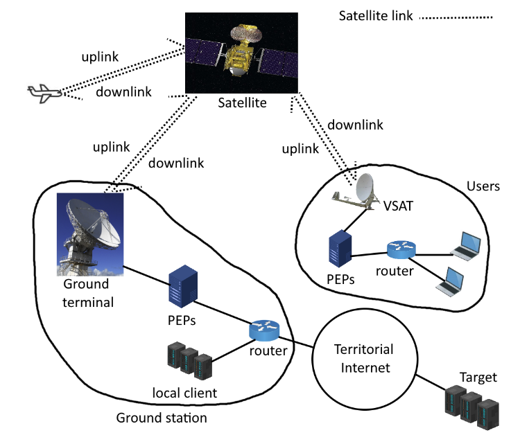

<u>Figure 1: Communication with satellite by satellite link (\*The
satellite is HYLAS 1)</u>

**Performance-enhancing proxies (PEPs)**

Before passing data to the satellite protocol layer such as the SCPS
Transport Protocol for satellite, or receive data from satellite
protocol layer, data had to past through PEPs first. To connect to the
PEPs before terminal (We can count them as a whole), the internet
protocol used is the same as connect to a target in terrestrial/local
network through IP-TCP. The below figure shows how a PEPs incorporated
into the network.

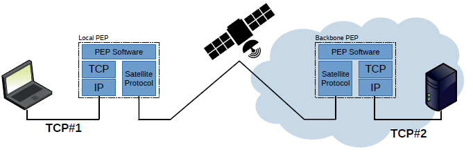

<u>Figure 2: PEPs inside the network</u> \[1\]

PEPs are usually used with TCP. \[1\] Some newer protocol like QUIC does
not compatible with PEPs, since PEPs do not work with encrypted
transport layer headers. Not at all, if use PEPs with Virtual Private
Network (VPN), the network performance will be bad, as PEPs cannot
access to transport layer headers and spoof into the connections.

The type of PEPs used is split TCP. The application of split TCP PEPs
can improve overall TCP performance within satellite link. \[2\] PEPs
can lighten the negative effect caused by high latency that leads to
poor performance in the satellite link. For example, a round-trip time
(RTTs) of 600ms is common in traditional satellite network.\[1\] Assume
in default TCP, maximum window size is 64kB, max speed will be
64000\*8/0.6 ~=853 kbps, which is not acceptable on modern standard to
connect to internet. The great latency is caused by using GEO satellite,
the propagation delay is quite high when using TCP directly, since the
satellite is at very high position above ground as mentioned.

In split TCP, on sender side, the sender PEPs instead of receiver will
sent ACK back to the sender once data checksum is completed at sender
PEPs (data sent from sender). Sender PEPs will not intercept with ACK
from receiver, and data will then be passed to satellite protocol layer
to transport it through satellite link. Then data past to receiver PEPs
by satellite link. Similarly, on receiver side, the receiver PEPs will
receive data from satellite protocol layer and then send it to receiver.
And receiver PEPs will then receive ACK from receiver but not pass to
satellite protocol layer. Thus, ACK from receiver were received only by
receiver local PEPs instead of sender. See below figure for
illustration.

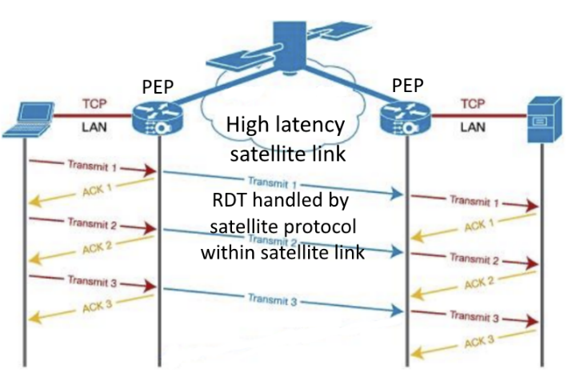

<u>Figure 3: Action inside TCP PEP, modified from</u> \[2\]

We can see the sender can receive respective ACK without waiting long
time that involved with satellite link which have high latency. Thus,
sender can send package more frequently than without PEPs. Thus, overall
performance increase.

For the case that corrupted package happened between sender and sender
PEPs, or receiver and receiver PEPs, as they are connected by TCP, the
normal process for handling corrupted package in TCP will be used. As
ACK from sender and receiver will not pass-through satellite link, all
reliable data transfer within satellite link will be handled by
satellite protocol.

The satellite protocol (in here, it involved Data Link Layer and
Physical Layer, closer to hardware level) mentioned above will not be
discussed, as they can be highly customized for a specific satellite, or
related information are not public accessible like Starlink. Abstract
and general protocol from Consultative Committee for Space Data Systems
(CCSDS) \[3\] may not applied to actual situation.

**Starlink and some difference between traditional satellite network**

Starlink is a satellite internet constellation which is operated by
SpaceX. Unlike the traditional satellite network, it is formed by
thousands of Starlink satellite which operated at low Earth orbit (LEO)
at around 550km. At 10/11/2022, according to
<https://satellitemap.space/> \[4\], there are 3506 Starlink satellite
on the LEO and 2825 is in active state, see Figure 2. As they are at
lower orbit, they move much faster than earth rotation speed and is not
stationary to ground.

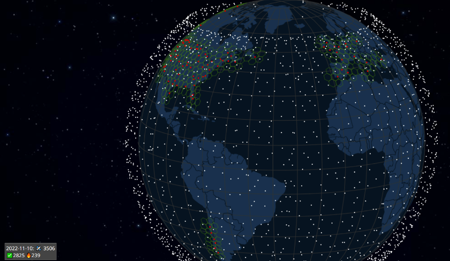

<u>Figure 4: White dot: Active Starlink satellite, green honey comb:
service area, red: Starlink gateway (ground station), figure captured
from:</u><https://satellitemap.space/> \[4\]

Due to a much lower operational orbit, Starlink has a significant
smaller land signal coverage pre satellite when compare to the satellite
at GEO used in traditional satellite. See below picture, use Europe as
example, we can see each Starlink satellite (left, cover barely a
country) has much less coverage \[1\] than the GEO HTS HYLAS-1 (right,
whole Europe). \[5\] However, as mentioned before, Starlink consists of
thousands of satellites, it is aimed to provided global coverage, which
is much larger than traditional satellite network which service to only
specific region.

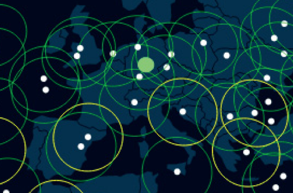
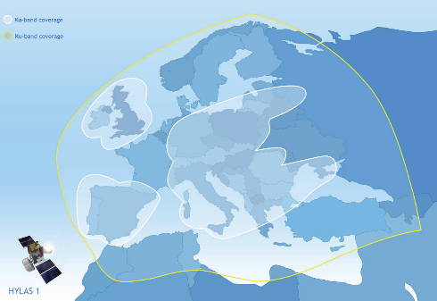

<u>Figure 5&6: (left) Starlink satellite coverage by individual (white
dot), figure modified from</u> <u>\[1\] , (right) Coverage of
HYLAS-1</u> <u>\[5\]</u>

The communication between a terminal and a single Starlink satellite is
similar to the traditional one as mentioned. See below figure as
illustration. However, Starlink do not use PEPs \[6\], but use TCP
directly over satellite protocol. It also supports VPN (as no PEPs),
UDP, ICMP. PEPs is no needed to be used as Starlink satellite operated
at LEO, which is much closer to ground (~65 times closer than GEO),
latency problems (will be compare later) is much smaller than GEO
satellite.

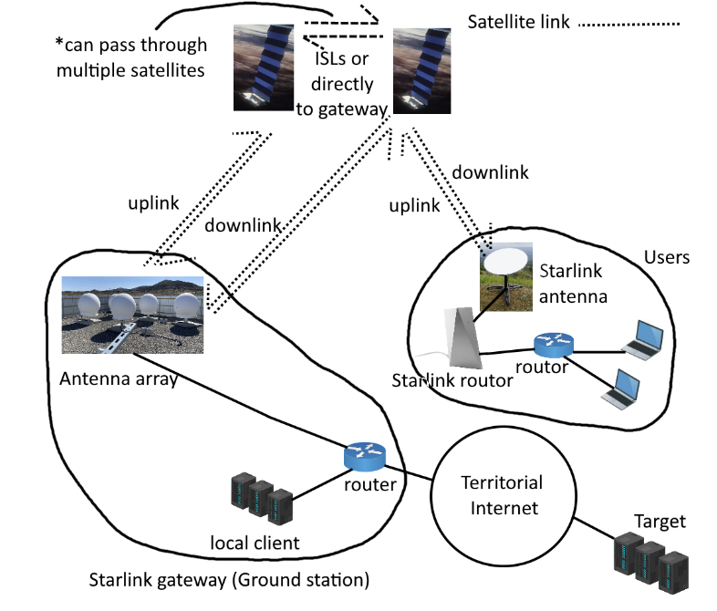

<u>Figure 7: Starlink architecture</u>

In the full architecture of Starlink, due to the low coverage of each
Starlink satellite, a single Starlink satellite may not connect well
(too far away) to a particular Starlink gateway (ground station) which
can cause great latency and low bandwidth on the most remote region. To
transfer respective data to it effectively, laser intersatellite Links
(ISLs) \[7\] present within different Starlink satellites to transfer
data between them quickly, to form a Starlink constellation. Such that
on the satellite link, a better latency and bandwidth can be guaranteed
by transfer data from a satellite that have bad connection to ground
station to the one that has good connectivity. By the ISLs, a routing
between Starlink satellites to balance load between each ground gateways
and Starlink satellites is also possible, to prevent overload on
satellite link between ground gateways and Starlink satellites, which
can cause negative effect on network performance. However, the Starlink
network is still in its developing and testing stage, although laser
intersatellite Links has already armed in last few months, it is not in
its fully operational status. The benefits by using optical ISLs may not
be very obvious now.

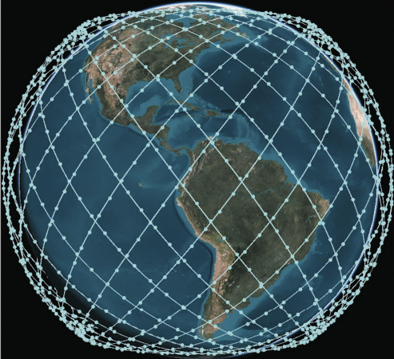

<u>Figure 8: Satellite constellation expected on phase 1 Starlink, dot
representing Starlink satellite</u> \[7\]

Furthermore, at customer side, as the Starlink satellite is not
stationary to ground, and moving very fast (At LEO, theoretically moving
at ~7.59 km/s), a VSAT in traditional satellite network cannot be used.
It is because a traditional VSAT change send/receive signal direction
relied on mechanical mechanism, wear can easily occur when tracing the
rapid moving Starlink satellite signal. Which cause the VSAT cannot
point to correct direction to receive/send signal to the satellite.
Thus, for Starlink, a phased-array antenna is used instead, which can
change signal direction with no mechanical mechanism instead by the
change on electrical signal only. Below figures shows a VSAT and a
phased-array antenna used by Starlink.

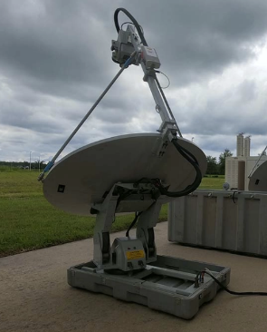

<u>Figure 9&10: VSAT (left) and phased-array antenna (right) used in
Starlink</u>

**Performance comparison**

The performance of Starlink including upload bandwidth, download
bandwidth, as well as latency will be compared to those in traditional
satellite network. For both traditional satellite network and Starlink,
performance data in United states will be used.

For the Starlink and traditional network (Provided by Viasat and
HughesNet), median data from third party measurer ookla.com will be
used, for the performance on 2022Q2 \[8\]. The reported median of
download bandwidth, median of upload bandwidth and median of latency
will be used directly, data were measured among the tested user
population at USA. The data should be trustworthy as data were collected
by Speedtest Intelligence ® (By Ookla) from its’
customer-initiated test among the respective user population, by using
service which is held by Ookla, and Ookla is a very well-known company
to test internet speed, their user base is large, one of its famous
services is [Speedtest.net](https://www.speedtest.net/), which is
well-known and used by the public. The original data figure was in
appendix a.

According to Viasat \[9\], its satellite internet service in USA were
powered by 4 satellite at GEO, ViaSat-1, ViaSat-2 (Newest), WildBlue-1
and Anik-F2. All of them are in the categories of traditional satellite
internet. Up to 100Mbps download speed is claimed on their website as
the best service plan they can offer (But restricted on specific region
only), relied on ViaSat-2. While there is no claim on upload speed on
their website. Which means that to achieve fastest speed, only ViaSat-2
can be used.

According to Hughes \[10\], their HughesNet in USA were powered by 2 GEO
satellite, EchoStar XVII and EchoStar XIX (Newest). The best plan offers
claimed 25Mbps download speed and 3 Mbps upload speed. To achieve
fastest speed, only EchoStar XIX can be used.

For a better comparison, the averages of traditional network were also
calculated.

Below figures shows median download bandwidth, median upload bandwidth
and median latency among users mentioned:

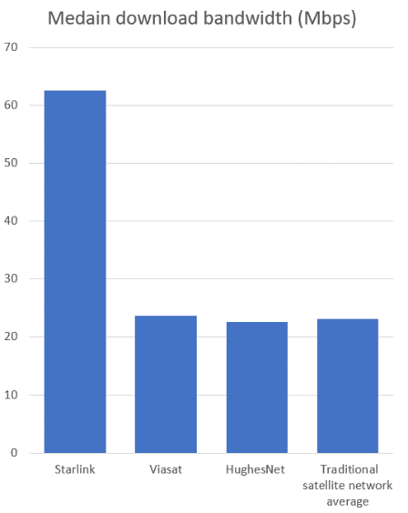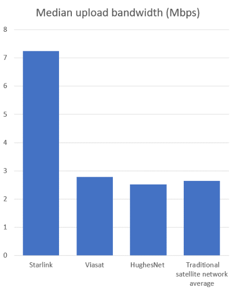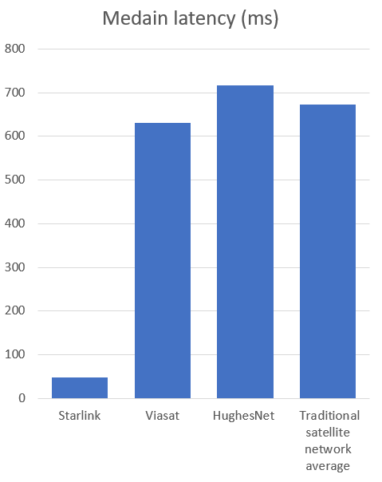

<u>Figure 11&12&13: Performance on: (left)Median download bandwidth,
(mid)Median upload bandwidth, (right)Median latency</u>

According to the figure above, for both median download and median
upload bandwidth, both Viasat and HughesNet have similar performance.
The median download bandwidth of HughesNet is near its claim, reach
22.62Mbps vs 25Mbps as claimed, difference less than 10%. However,
Viasat do not meet its claimed, only around one-forth of the claimed
max-download bandwidth, median download bandwidth 23.68Mbps had reached,
this indicate the majority of their users can only use up to one-fourth
of the maximum bandwidth of their internet. On upload bandwidth,
HughesNet claimed upload bandwidth 3Mbps is closed to actual median
2.52Mbps measured, claimed speed only 19% higher than claimed.

On median latency, Viasat performs slightly better than HughesNet, 631ms
vs 716ms respectively. Latency of Viasat is ~11.9% shorter than
HughesNet.

On overall, all satellite network and Starlink have a download bandwidth
around 10 times of the upload bandwidth. This is caused by the low power
and small dish size terminal on user side, as more power and bigger dish
size can transfer more data to the satellite. The small dish size and
low power design on terminal at customer side is limited by the cost of
equipment and available space.

However, when compare the performance of the average of two traditional
satellite internet providers with the performance of Starlink, Starlink
performance is significant better in every aspect. The average of median
value of download bandwidth, upload bandwidth and latency of traditional
satellite internet is 23.15Mbps, 2.65Mbps, and 673.5ms respectively.
When compare to that of Starlink, 62.53 Mbps, 7.24 Mbps, 48ms
respectively, Starlink download bandwidth is ~2.7 times faster, upload
bandwidth is ~2.73 times faster, overall bandwidth is 2.715times faster
and latency is significantly ~14 times shorter.

The extraordinary of performance on latency of Starlink can be explained
by the attitude of the satellite. As mentioned, Starlink is at LEO,
550km, while traditional GEO satellite is at GEO, 35786km, the signal
has to travel ~65 times of distance to reach GEO when compare to LEO
satellite. Thus, in traditional satellite network, the latency due to
signal propagation is very significant than that of Starlink, caused
such larger latency difference.

The faster download bandwidth and upload bandwidth can be explained by
the less interference on the signal which can cause signal loss. As
signal travel much longer in space at traditional satellite internet,
the amount and chance of the signal being degraded, even corrupted by
solar activity is much greater than Starlink. As Starlink satellite are
much closer to earth, such that negative effect on signal caused by
solar activity can be minimized. Furthermore, the higher performance of
both download bandwidth, upload bandwidth and latency can also be
explained by the present of ISLs as aforementioned. Moreover, ISLs is
still in its early practical status, it may not contribute that much on
the performance of Starlink for now.

**Conclusion and summary**

The Starlink is clearly a satellite internet constellation that has
significant better performance than that of traditional satellite
internet.

Starlink is still an ongoing project, its satellite number, ground
gateway number, user number, as well as the spec of the satellite, is
keep increasing, especially the fully armed version of ISLs will be
fully applied into the Starlink network in the future. It can be
expected the Starlink performance will become better and better in the
future.

Below is a table shows summary and comparison between Starlink and
traditional satellite internet.

<u>Table a: Overall summary between Starlink and traditional satellite
internet</u>

|                                                             | Starlink                                                           | Traditional satellite internet                     |
|-------------------------------------------------------------|--------------------------------------------------------------------|----------------------------------------------------|
| Download speed                                              | 2.7 times faster                                                   | 1 for comparison                                   |
| Upload speed                                                | 2.73 times faster                                                  | 1 for comparison                                   |
| latency                                                     | 14 times shorter                                                   | 1 for comparison                                   |
| Number of satellites in the network                         | Thousands                                                          | Only few                                           |
| Use optical ISLs?                                           | Yes                                                                | No                                                 |
| Number of satellites to achieve best performance            | One or multiple by ISLs                                            | One                                                |
| Use PEPs ?                                                  | No                                                                 | Yes                                                |
| Mainly use what protocol on top of satellite protocol/PEPs? | IP-TCP. Furthermore, VPN, UDP, ICMP are also supported by Starlink | IP-TCP if in typical case used with Split TCP-PEPs |
| Satellite orbit                                             | LEO 550km                                                          | GEO 35786km                                        |
| Coverage by one satellite                                   | Small                                                              | Much larger                                        |
| Coverage overall                                            | Much Larger, globally in fully developed stage                     | Smaller such as only cover a Europe                |
| Antenna used (Customer side)                                | VSAT                                                               | Phased-array antenna                               |

# References

| \[1\]  | J. Deutschmann, K. -S. Hielscher and R. German, "Broadband Internet Access via Satellite: Performance Measurements with different Operators and Applications," *Broadband Coverage in Germany; 16th ITG-Symposium*, 2022, pp. 1-7.                                                                                                                                                 |
|--------|------------------------------------------------------------------------------------------------------------------------------------------------------------------------------------------------------------------------------------------------------------------------------------------------------------------------------------------------------------------------------------|
| \[2\]  | AVANTI COMMUNICATIONS LTD, “Satellite and Terrestrial Network for 5G- D4.3 Multi-link and Heterogeneous Transport - Analysis, Design and Proof of Concepts,” pp. 13–14, May 2020, doi: 10.3030/761413.                                                                                                                                                                             |
| \[3\]  | Consultative Committee for Space Data Systems (CCSDS). *OVERVIEW of SPACE COMMUNICATIONS PROTOCOLS*. July 2014, public.ccsds.org/Pubs/130x0g3.pdf. Accessed 12 Nov. 2022.                                                                                                                                                                                                          |
| \[4\]  | ‌“Starlink Satellite Tracker.” *Starlink Satellite Tracker*, satellitemap.space/.                                                                                                                                                                                                                                                                                                   |
| \[5\]  | Avanti Communications Group plc. *HYLAS 1*. sky-brokers.com/wp-content/uploads/2020/12/Avanti-Hylas-1-Satellite-Footprint.pdf. Accessed 12 Nov. 2022.                                                                                                                                                                                                                              |
| \[6\]  | F. Michel, M. Trevisan, D. Giordano, και O. Bonaventure, ‘A First Look at Starlink Performance’, στο *Proceedings of the 22nd ACM Internet Measurement Conference*, Nice, France, 2022, σσ. 130–136.                                                                                                                                                                               |
| \[7\]  | A. U. Chaudhry and H. Yanikomeroglu, "Laser Intersatellite Links in a Starlink Constellation: A Classification and Analysis," in *IEEE Vehicular Technology Magazine*, vol. 16, no. 2, pp. 48-56, June 2021, doi: 10.1109/MVT.2021.3063706.                                                                                                                                        |
| \[8\]  | Fomon, Josh. “Starlink Slowed in Q2, Competitors Mounting Challenges \| Ookla®.” *Ookla - Providing Network Intelligence to Enable Modern Connectivity*, 20 Sept. 2022, [www.ookla.com/articles/starlink-hughesnet-viasat-performance-q2-2022. Accessed 13 Nov. 2022](http://www.ookla.com/articles/starlink-hughesnet-viasat-performance-q2-2022.%20Accessed%2013%20Nov.%202022). |
| \[9\]  | Viasat. “Global Communications \| Services, Solutions & Satellite Internet.” *Viasat.com*, 2022, [www.viasat.com/](http://www.viasat.com/).                                                                                                                                                                                                                                        |
| \[10\] | Hughes. “HUGHES \| Managed Networks and Satellite Technologies.” *Hughes.com*, 2019, www.hughes.com/.                                                                                                                                                                                                                                                                              |

<u>Appendix a: Data from ookla, data for Starlink, Viasat and HughesNet
had been pointed out</u>

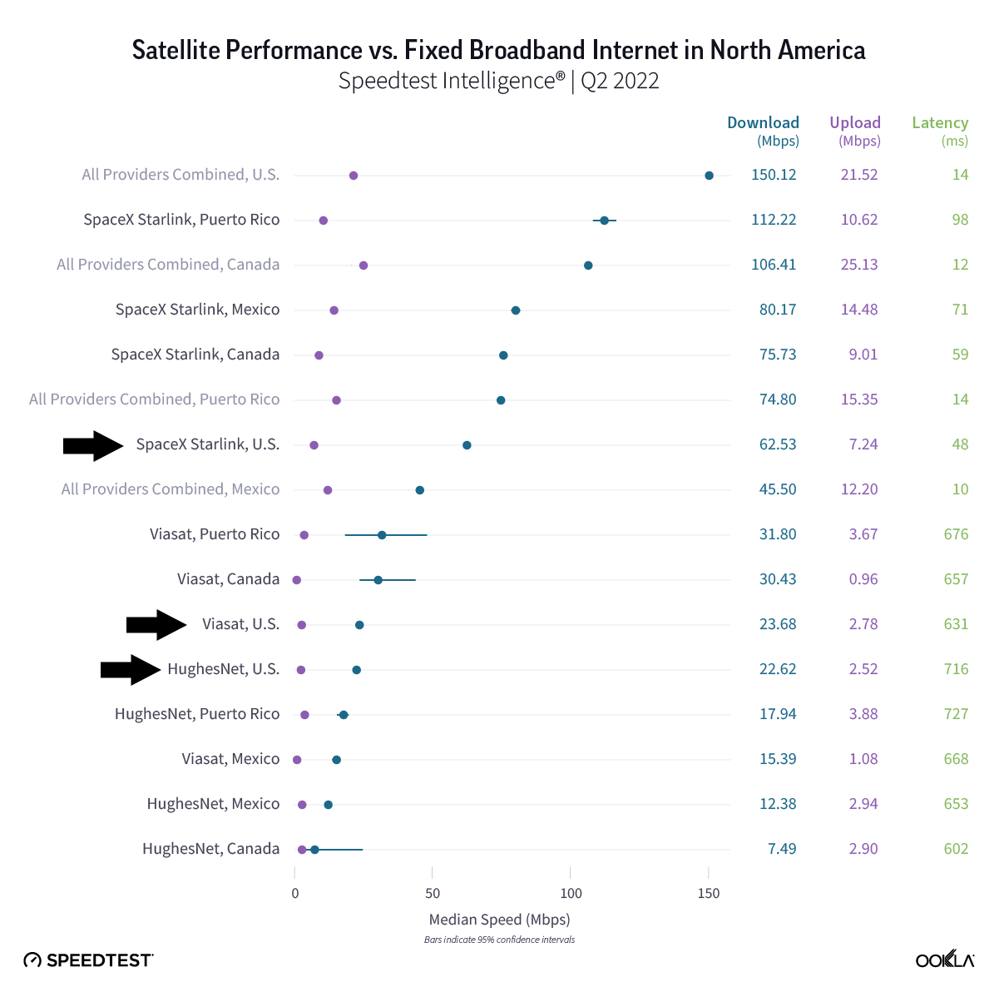
